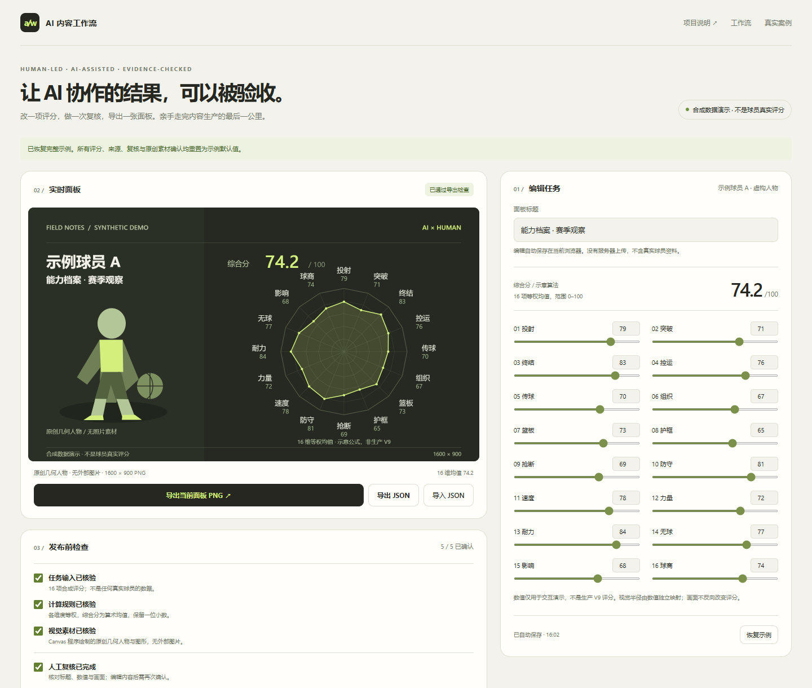
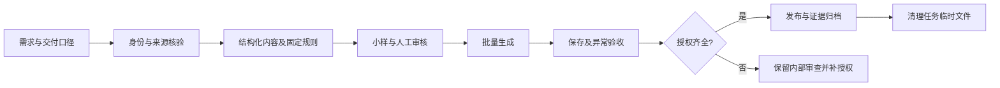

# AI 内容生产工作流 · NBA 案例

把一次性的 AI 对话，整理成能复用、能审核、能交付的内容生产流程。

这份作品集来自持续迭代的体育面板制作实践。项目负责人定义内容需求、制定评分与视觉标准、审核争议项和验收结果；AI 协助检索、结构化资料、编写工具及执行检查。这里展示的是**内容运营与 AI 协作能力**，不把 AI 生成的代码等同于负责人独立编程能力。

**[打开可操作演示](https://beishangchayedan.github.io/ai-content-workflow-nba/)** · [完整工作流](docs/workflow.md) · [真实案例与证据边界](docs/case-study.md) · [复用提示词](templates/prompts.md)

## 先试一次

1. 打开演示，修改一项能力值或内容标题，观察人工复核状态失效。
2. 完成人工复核，导出当前面板 PNG；刷新页面确认修改恢复。
3. 点击「模拟缺少授权」，检查导出是否被阻断。
4. 导出 JSON，再导入：数据恢复，但来源、复核和授权需要重新确认。

演示使用虚构人物、合成数据、原创几何图形和系统字体，无真实球员照片。示意分数为 16 项平均值，**不是生产项目的评分公式，也不是球员事实**。本地浏览器存储仅用于演示，不等于生产系统的正式写盘、修订或回滚机制。



## 实际解决的问题

| 生产问题 | 固化的方法 | 验收依据 |
| --- | --- | --- |
| AI 每轮对同一事实、评分或视觉给出不同结果 | 身份及来源登记；固定评分公式；视觉与评分分离 | 数据清单、公式检查、渲染合同 |
| 批量输出中漏图、串图、尺寸不一致 | 固定节点和文件命名；先小样再批量 | 文件集合、数量、尺寸、哈希 |
| 用户修改在下一次生成时丢失 | 显式修订优先级；冲突检测；失败回滚 | 真实保存、刷新、关闭重开及故障注入 |
| 找到图片就误以为可以公开使用 | 来源与授权分别登记；输出前检查授权 | 缺授权时在创建输出前阻断 |
| 临时渲染和浏览器文件持续占用磁盘 | 任务工作区登记；归档必要证据；验收后收尾 | 清理收据、前后保护文件哈希 |

## 已有生产规模

截至 **2026-09-16**，本地 NBA 正式项目清点为 **13 个项目、229 个节点、687 张 3840×2160 PNG**。其中 11 个项目有可编辑审查入口，2 个历史项目为只读入口。上述是文件交付规模，不是视频数量、用户数量或业务收益。

数量与尺寸在本次作品集整理中重新核验；保存恢复、回滚等功能证据来自明确范围的既有验收记录，不能理解为对 13 个项目进行了一次新的全量功能测试。公开仓库提供去隐私摘要，原始资产和完整报告留在本地，**不是第三方独立认证**。详见 [案例说明](docs/case-study.md) 与 [证据索引](evidence/summary.json)。

## 工作流



这里公开的是方法、模板与独立编写的简化演示，没有复制生产源码、真实人物图片、商业字体或个人简历。

## 文件导航

- `index.html`：可直接运行的交互演示，零运行依赖。
- `docs/workflow.md`：每一步的输入、责任人、输出与检查条件。
- `docs/case-study.md`：真实生产案例、取舍和未覆盖范围。
- `templates/production-brief.md`：可复制的新任务制作单。
- `templates/prompts.md`：按阶段使用的 AI 协作提示词。
- `evidence/summary.json`：去隐私的数量与验收摘要。
- `tests/smoke.cjs`：浏览器验收脚本，覆盖主要交互与导入导出边界。

## 本地运行与复验

页面可以直接双击打开。若需要稳定的浏览器存储与完整测试，推荐通过本地服务器访问：

```sh
python -m http.server 8000 --bind 127.0.0.1
# 打开 http://127.0.0.1:8000
```

可选浏览器测试（需要 Node.js 20+）：

```sh
npm install
npx playwright install chromium
npm test
```

测试会使用独立临时浏览器和本地端口；可通过 `CHROME_PATH` 指定现有 Chrome，通过 `ARTIFACT_DIR` 指定输出位置。不要在原生产项目或个人资料目录运行测试。

## 相关作品

[AI 内容工作流 · 足球案例](https://beishangchayedan.github.io/ai-content-workflow/) 使用另一套题材数据和示范计算规则。两个案例共享需求拆解、来源追踪、人工复核和验收方法，具体评分口径分别说明。

## 使用范围

新写的演示代码、文档与模板按 MIT 许可开放。此许可不延伸至未公开的 NBA 素材、人物肖像、商标、字体或第三方来源。生产案例中的体育评分包含编辑判断，不是官方评定。代码由 AI 协助实现，内容流程和验收标准由项目负责人主导。
